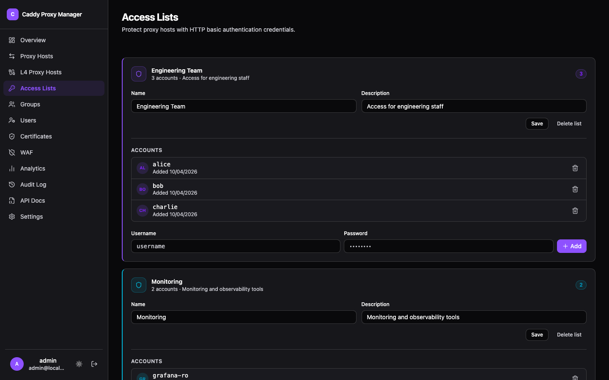

Two ways to put something in front of a host that does not involve a login page. For the login-page
version, see [forward auth](../forward-auth/).

## Access lists

Multi-account HTTP basic auth, assignable per proxy host. Passwords are bcrypt-hashed. One list can
protect several hosts, and adding an account to the list grants it everywhere the list is used.

Simple, and appropriate for exactly the cases basic auth is appropriate for: an internal tool, a
staging site, something you want off the open internet without standing up an identity provider.

## Mutual TLS

mTLS asks the *client* for a certificate. A visitor without one does not get a connection at all,
which is a stronger boundary than any password — there is nothing to phish and nothing to guess.

CPM includes a CA for this. Issue client certificates from the Certificates page, hand them to the
people or machines that need them, and enable mTLS on the hosts they should reach.

**Revocation is fail-closed.** Revoking a certificate rejects it immediately, and revoking every
certificate rejects every connection rather than falling open to none-required.

## mTLS RBAC

Certificates can carry roles, and roles can be given path rules per host. So one certificate reaches
the application while another also reaches `/admin/*`:

| Path | Requires |
| ---- | -------- |
| `/*` | Any valid client certificate |
| `/admin/*` | The `ops` role |

Paths can also be **excluded**, which is how a health check endpoint or an ACME challenge path stays
reachable without a certificate.

Roles are assigned to issued certificates, so revoking one certificate does not disturb the others
holding the same role.
