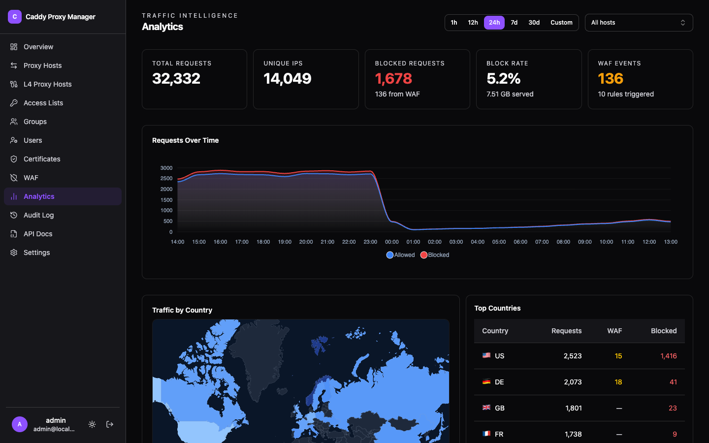
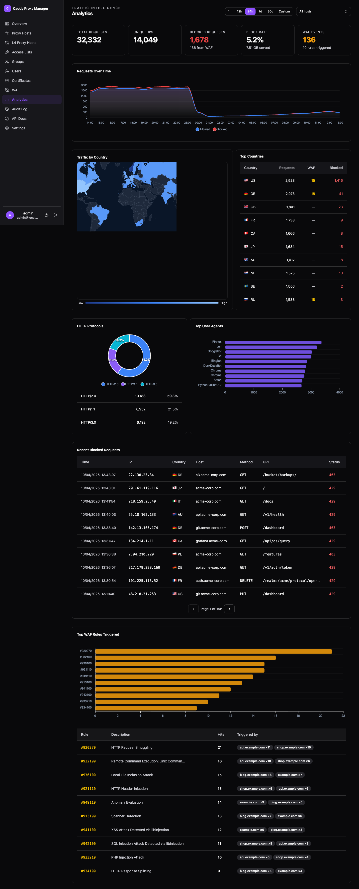

Traffic and WAF events are written to a bundled ClickHouse instance and queried back as charts. It
is optional — everything else works without it.



## What you get

- **Request volume** over a time range you pick, filterable by host.
- **Protocol breakdown** — HTTP versions and TLS versions actually in use.
- **A country map**, from the same GeoIP databases [geo blocking](../geo-blocking/) uses.
- **Top user agents**, which is usually how you notice a scraper.
- **Blocked requests**, paginated and searchable, linking back to the [WAF](../waf/) rule or geo
  rule that produced them.

## Turning it on

Open **Settings → Analytics**, tick **Collect analytics**, and set a ClickHouse password. Saving
starts the container — nothing to change in `.env`, no compose profile to list, because the
[agent](../agent/) runs the compose command for you with the saved credentials.

Three things to expect:

- **The first start pulls the ClickHouse image**, which takes a few minutes on a slow link. The save
  returns immediately and the agent reports progress under **Settings → Agent**.
- **Turning it off stops the container but keeps the data.** History survives, and turning it back
  on picks up where it left off.
- **Pick one owner.** Once credentials live in Settings, drop `clickhouse` from `COMPOSE_PROFILES`
  and delete `CLICKHOUSE_PASSWORD` from `.env`. Leaving both means your own `docker compose up -d`
  also creates the container, from the now-stale `.env` values.

Without an agent, Docker is the only thing that can start ClickHouse, so use the profile:

```ini
COMPOSE_PROFILES=clickhouse
CLICKHOUSE_PASSWORD=your-clickhouse-password   # openssl rand -base64 32
```



## Retention

30 days by default, enforced by ClickHouse's own TTL. Change it with `CLICKHOUSE_RETENTION_DAYS`;
on the next startup the existing tables' TTL is migrated and expired data is purged.

## Disk writes

ClickHouse's internal diagnostic log tables are turned off by a config override the stack mounts.
Left on, they flush every few seconds whether or not anyone is using the proxy, which is several GB
a day on an idle machine. CPM never queries them.
