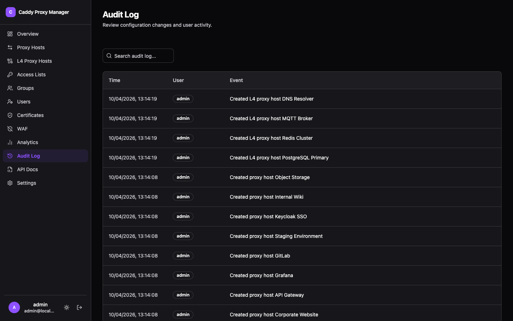

Every configuration change is recorded: what changed, which account changed it, and when.

## What it covers

Creating, editing, enabling, disabling and deleting proxy hosts, L4 hosts, certificates, access
lists, users, groups and settings — the operations that alter what the proxy does. Reads are not
logged; the log exists to answer "why is this host configured like this", not to track browsing.

## Searching it

Server-side search and pagination, like the other data tables. Search covers the action, the entity
and the account, so "who disabled this host last Tuesday" is one query rather than a scroll.

## Attribution

Changes made through the [REST API](../rest-api/) are attributed to the token's owner, so an
automated change is traceable to the person whose token made it rather than appearing anonymous.

## Access

Admin-only, alongside analytics and the API docs.
