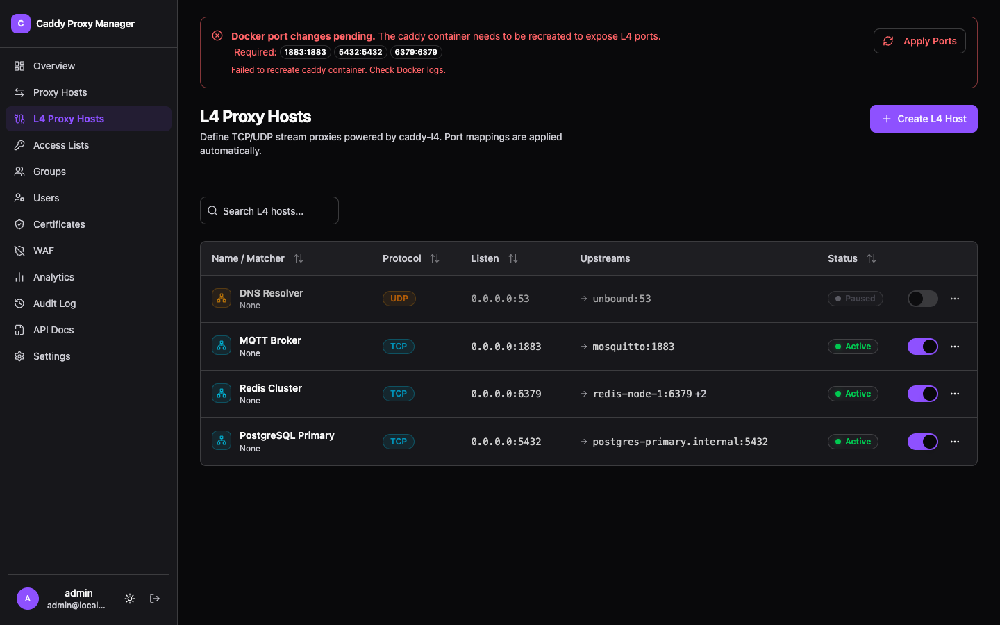

Not everything is HTTP. L4 proxy hosts forward raw TCP and UDP streams: a database, a game server,
an SSH endpoint, anything that speaks its own protocol.

## What it can match on

- **Port** — the listening port on the Caddy host.
- **TLS SNI** — several TLS backends can share one port, routed by the name in the handshake. This
  works without terminating TLS, so the certificate stays with the backend.

## PROXY protocol

Both v1 and v2, so the backend sees the real client address instead of Caddy's. The backend has to
be configured to expect it — sending PROXY protocol to something that is not listening for it
breaks the connection outright.

## Load balancing and health

Seven selection policies, with active and passive health checks in the same shape the
[HTTP hosts](../reverse-proxy/) use.

## Geo blocking below HTTP

[Geo blocking](../geo-blocking/) applies here too, per host. At layer 4 there is no response body to
send, so a blocked connection is closed rather than answered.

## Ports are managed for you

A published port has to exist on the container, and container ports are fixed when the container is
created. Adding an L4 host therefore needs the Caddy container recreated — the [agent](../agent/)
writes a compose override with the new port list and recreates Caddy, so the port appears without
you editing a compose file. The dashboard shows when a port change is pending a recreate.

:::note
Layer 4 is a compiled-in Caddy module. If L4 hosts are greyed out, turn the module on in
[Caddy Build](../caddy-build/) and rebuild.
:::
