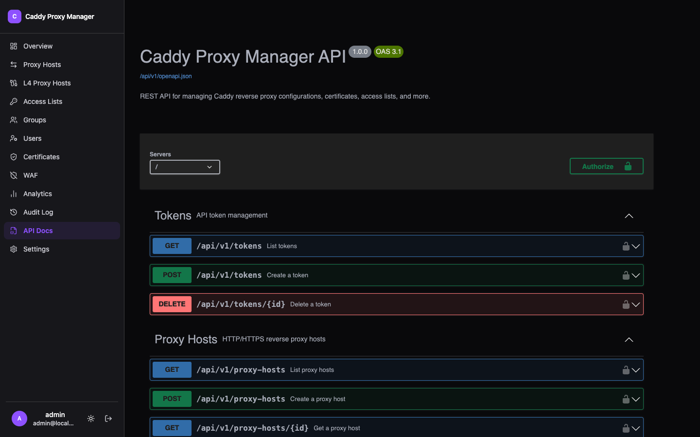

Everything the dashboard does, it does through an API you can use too.



## Where it is

`/api/v1/`, with interactive OpenAPI 3.1.0 documentation at `/api-docs`. The spec is generated from
the same definitions the routes use, so it describes what is actually there.

## Authentication

Bearer tokens.

```bash
curl -H "Authorization: Bearer $CPM_TOKEN" \
  https://cpm.example.com/api/v1/proxy-hosts
```

Tokens are created from **Profile → API Tokens** in an authenticated dashboard session, with an
optional expiry. That restriction is deliberate: an existing bearer token cannot mint replacement
credentials, so a leaked token cannot extend its own life.

## What a token can reach

A token carries its owner's role. Viewer and user tokens are restricted to the same user-scoped
capabilities their owner has in the dashboard.

The management endpoints are **admin-only**, including for operators — [group grants](../users-and-groups/)
delegate the dashboard, not the API. An operator's token reaches the same user-scoped endpoints a
user's does.

## Errors

`/api/v1/` responses are a machine contract, so they stay in English regardless of the dashboard's
language, and they carry a stable code alongside the message.

## Health

`/api/health` is public and unauthenticated — it is what the container health check probes. It also
answers the [dashboard host](../dashboard-host/) reachability probe when asked with a nonce.
