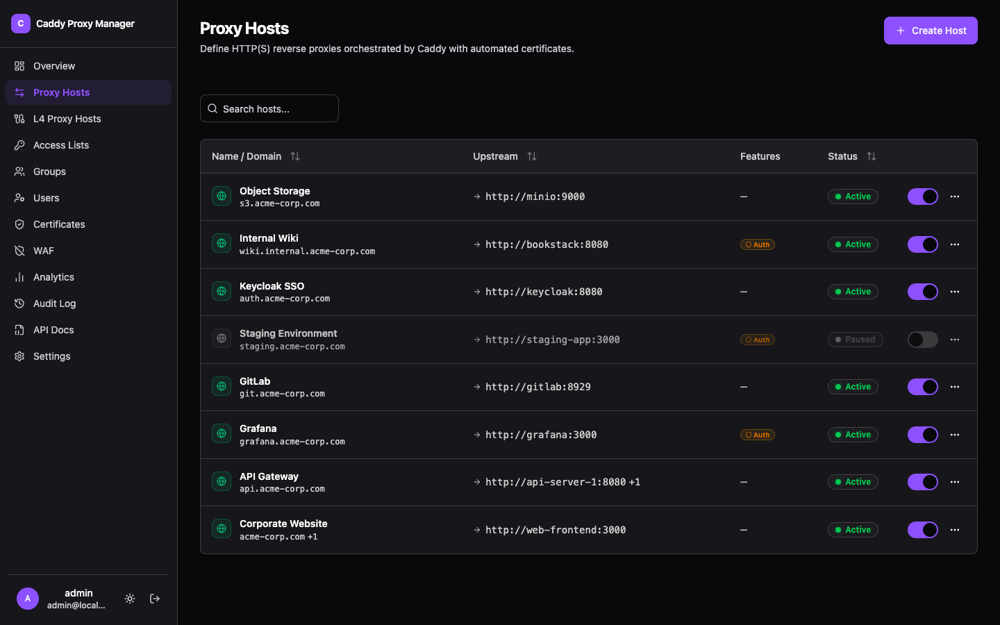
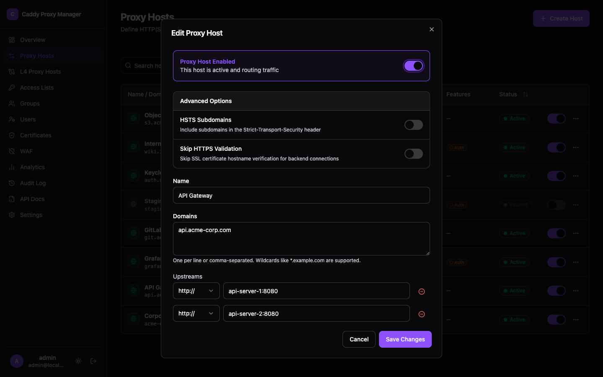

A proxy host maps one or more domains onto one or more upstreams. It is the thing this product is
mostly for, and most of the other features attach to it.

## Upstreams and load balancing

A host can have any number of upstreams. Twelve selection policies are available, including
round-robin, least-connections, weighted, and hashing by IP, query, header or cookie.

Health checks come in both forms:

- **Active** — CPM asks the upstream on an interval and takes failures out of rotation.
- **Passive** — failures on real requests count against an upstream, with a configurable number of
  failures and a duration to keep it out.

Retries let a failed request try another upstream rather than surfacing the error.

## Location rules

Path-based routing inside one host: send `/api/*` to one backend and `/ws/*` to another, each with
its own upstreams, load balancing and health checks.

## Redirects and rewrites

Per-host redirect rules with a status of 301, 302, 307 or 308 — 307 and 308 preserve the request
method, which matters for anything but a GET. Path prefix rewriting happens before the request
reaches the upstream.

## DNS controls

**Upstream DNS pinning** resolves upstream hostnames when the configuration is applied and writes
the addresses into Caddy's config, rather than leaving Caddy to resolve them per request. You can
choose IPv4, IPv6 or both. **Custom resolvers** can be set per host.

Pinning is skipped for HTTPS upstreams when one handler has several different HTTPS hostnames,
because a single pinned address cannot carry more than one SNI name.

## Headers

Request and response headers can be added, replaced or removed per host. The host header is
forwarded by default, which is what most applications behind a proxy expect.
